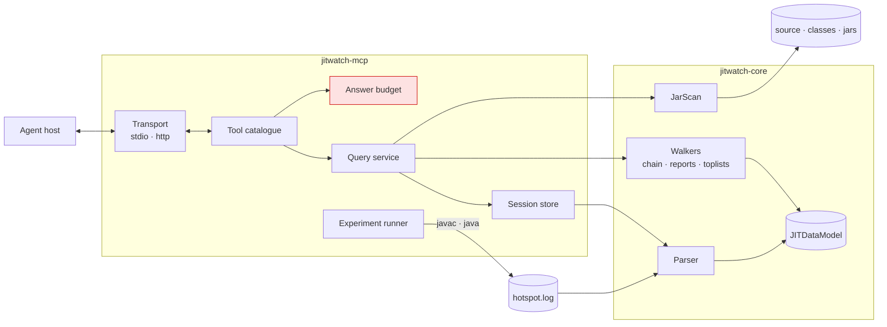
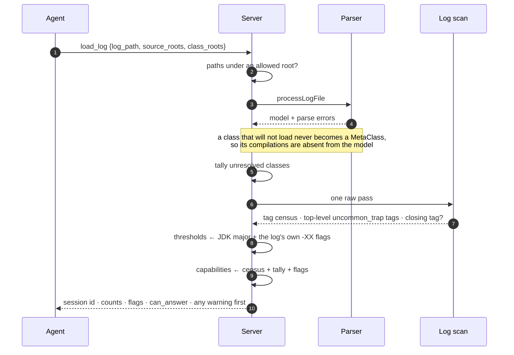
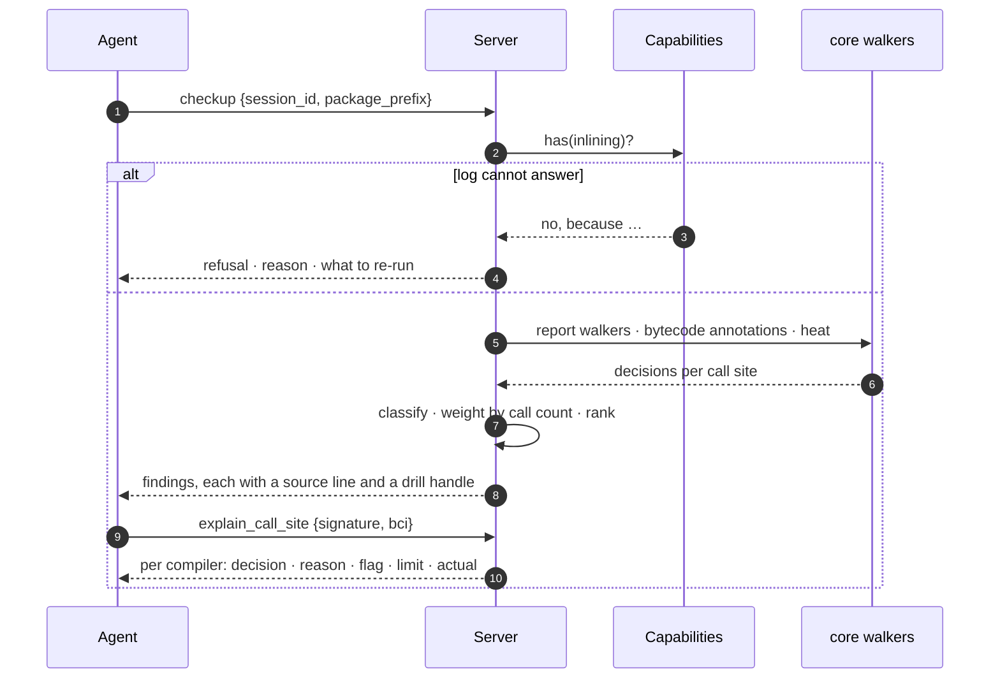
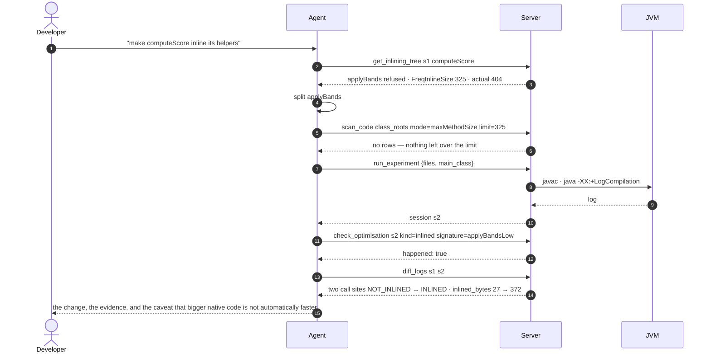

# JITWatch MCP Server — Design

An MCP server over JITWatch's HotSpot compilation log analysis. An agent loads a `-XX:+LogCompilation` log and asks what the JIT did: was this call inlined, why not, against which limit, what deoptimised, what changed since the last run.

---

## 1. Architecture



**Session** — one parsed log plus its source and class roots, threshold table, signature index and capability set. In memory, LRU-bounded, dies with the process.

**Capability set** — decided at load: which questions this log can answer. A run capped at `TieredStopAtLevel=1` has no C2 and therefore no inlining decisions. A truncated log has no `<task>` bodies. An unmounted classpath means compilations missing from the model entirely, not merely missing detail. Tools consult it and refuse by name rather than returning empty.

**Threshold table** — inlining limits per JDK major, overlaid with `-XX:` flags read from the log's own `<args>`. Every refusal is reported against the limit that actually applied.

**Answer budget** — the single door every response passes: list caps, tree depth, string length, total bytes, cursors. Nothing bypasses it.

**Query service** — the only caller of `core`. Core types never cross the transport.

**Transport** — stdio, where the host owns the lifecycle; or HTTP, where the server outlives its clients and every call prints on the console that started it.

Every answer has two halves:

```json
{ "plain":    "JitDemo.big was not inlined into main at line 77: 404 bytes against a 325-byte limit.",
  "evidence": { "bci": 25, "compile_id": 12, "compiler": "C2", "tier": 4,
                "reason": "hot method too big", "reason_normalised": "CALLEE_TOO_LARGE",
                "flag": "FreqInlineSize", "limit": 325, "actual": 404, "headroom": -25,
                "call_count": 157701 } }
```

---

## 2. Tools

**Orient**

- **`load_log`** — parse a log; return a session id, the run summary, the flags in effect, and what this log can and cannot answer.
- **`list_sessions`** — which logs are loaded.

**Triage**

- **`checkup`** — ranked findings, worst first, each with a source line and something to try. The entry point.
- **`top_list`** — rank the run by one dimension: largest native, longest compile, inline-failure reasons, most decompiled, intrinsics, hot throws, deopt reasons.

**Drill**

- **`find_methods`** — fuzzy name to signature.
- **`explain_method`** — one method's full story: compilations, tiers, sizes, what it inlined, what refused it, what it lost.
- **`explain_call_site`** — one call: inlined or not, the reason, the flag, the limit, the headroom.
- **`get_inlining_tree`** — what actually became part of a compiled method, and where the compiler stopped.

**Verify**

- **`check_optimisation`** — did the thing I expected happen? `kind` is `inlined`, `allocation_eliminated`, `lock_elided`, `intrinsic_used`, `vectorised` or `loop_unrolled`. Binary answer; when it is no, `why_not` names the inlining boundary upstream.
- **`diff_logs`** — what changed between two runs, keyed by `(signature, bci, callee)` so compile ids and timestamps cannot register as changes.

**Pre-empt**

- **`scan_code`** — static bytecode scan of jars and class dirs. No log, no JVM, no warm-up. Answers "will this inline?" in the edit loop.
- **`run_experiment`** — compile and run under controlled `-XX:` flags, then load the result as a new session.

---

## 3. Examples

### A hot path that will not optimise

An endpoint is slower than its profile suggests. The profiler says `computeScore` is hot and stops there.

```
checkup s1 package_prefix=com.acme.pricing

  HOT_METHOD_TOO_LARGE   high
  "The JVM calls applyBands 1,204,338 times from computeScore but cannot merge it in:
   it is 404 bytes of bytecode against a 325-byte limit. Every call pays full overhead."
  PricingEngine.java:212 · fix: split applyBands so each part is under 325 bytes
```

Splitting the method is the change. The 325 is not folklore — it is `FreqInlineSize` as it applied to that JDK on that command line.

### The third implementation

A release goes out and latency on one path doubles. The diff that caused it is in another module: someone added a third `PricingRule`.

```
explain_call_site s1 signature=RuleChain.evaluate bci=14

  C2 compile 3041: NOT_INLINED
  reason "no static binding" → MEGAMORPHIC_CALL
  receivers: FlatRule, TieredRule, PromoRule
```

HotSpot profiles two receiver types per call site. A third makes it megamorphic: no inlining, and every optimisation downstream of that boundary stops with it. The fix is to reduce types on the hot path, not to tune a flag.

### Did the fix actually work

```
diff_logs s1 s2 scope=com.acme.pricing

  applyBandsLow   NOT_INLINED → INLINED
  applyBandsHigh  NOT_INLINED → INLINED
  computeScore    native_size 216 → 412 · inlined_bytes 27 → 372
```

Binary, one run, no statistics. It answers "did the optimisation fire", which is the question a benchmark cannot separate from noise.

### A log that cannot answer

```
load_log /tmp/app.log

  "Loaded 4264 compilations of 3925 methods from a JDK 17 run as session s1, but the run
   used -XX:TieredStopAtLevel=1, so C2 never ran and the log contains no inlining
   decisions. Re-run without that flag."

  can_answer: { inlining: false, compile_times: false, deoptimisation: true,
                model_complete: true }

checkup s1
  → refused, same reason, with the remedy
```

An empty finding list would have read as a clean bill of health. That is the worst answer available, so it is the one answer the server never gives.

---

## 4. Flows

### Load



The scan exists because the parser keeps ten tags and drops the rest: a top-level `<uncommon_trap>` never reaches the model, and on a log without `<parse>` trees those traps are the only evidence there is.

### Diagnose and drill



### Change and verify



`scan_code` before `run_experiment` is deliberate: the static check costs a second, the run costs minutes.
